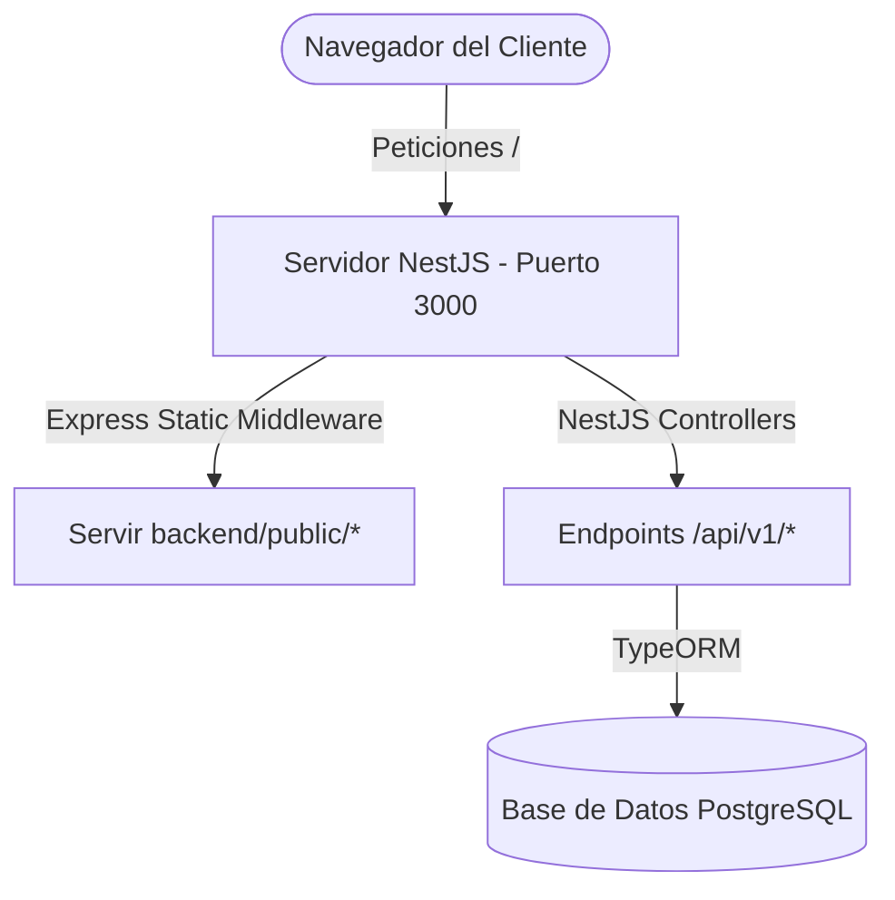

# 🏛️ Documentación de Arquitectura y Estructura - Art Huila

Esta documentación detalla la estructura unificada del proyecto **Art Huila** para guiar a los futuros desarrolladores y administradores del sistema.

---

## 🚀 Vista General de la Arquitectura

Para simplificar el despliegue local, mitigar problemas de CORS y acelerar el rendimiento, el sistema de **Art Huila** se ha unificado en una **Arquitectura Monolítica de un solo puerto (3000)**:



* **Frontend y Assets:** Se encuentran dentro de la carpeta `backend/public/`. Son servidos de manera estática y nativa por el backend NestJS (vía Express `static` middleware).
* **Backend API:** Expuesta bajo el prefijo `/api/v1/` controlado por los controladores y módulos nativos de NestJS.
* **Base de datos:** Conectada a través de TypeORM usando la variable de entorno `DATABASE_URL`.

---

## 📁 Estructura de Directorios Clave

```text
ecomerce_Arthuila/
│
├── backend/                        # Carpeta principal del Monolito
│   ├── dist/                       # Archivos compilados de NestJS (generados al compilar)
│   ├── public/                     # FRONTEND UNIFICADO (Vistas estáticas y Assets)
│   │   ├── css/                    # Hojas de estilo CSS (base.css, auth.css, etc.)
│   │   ├── js/                     # Scripts de JavaScript (api.js, dashboard-artesano.js, etc.)
│   │   ├── img/                    # Imágenes y logos del sitio
│   │   ├── locales/                # Archivos de traducción internacionalización (i18next)
│   │   ├── ESTRUCTURA.md           # Esta documentación
│   │   └── *.html                  # Páginas HTML (index.html, login.html, etc.)
│   │
│   ├── src/                        # Código fuente del Backend NestJS
│   │   ├── main.ts                 # Punto de entrada de NestJS (sirve estáticos y CORS)
│   │   └── app.module.ts           # Configuración del módulo raíz de NestJS
│   │
│   ├── seed.ts                     # Script de siembra para poblar la DB con datos de prueba
│   ├── package.json                # Scripts y dependencias del Backend
│   └── tsconfig.json               # Configuración de TypeScript
│
├── start-local.bat                 # Lanzador rápido con doble clic para Windows
└── start-local.ps1                 # Script de automatización de arranque local en puerto 3000
```

---

## 📡 Despliegue de Alto Rendimiento en Producción (Nginx)

Para entornos de producción reales con tráfico elevado, la mejor práctica de ingeniería de software es **colocar un servidor Nginx por delante** como proxy reverso. 

Nginx servirá los archivos estáticos (CSS, JS, HTML e imágenes) de forma ultra rápida directamente desde el disco duro de la máquina, y delegará únicamente las peticiones de lógica de negocio (`/api/v1/*`) al proceso de NestJS.

### ⚙️ Configuración Recomendada de Nginx (`/etc/nginx/sites-available/art-huila`)

```nginx
# Configuración del servidor upstream de NestJS
upstream nestjs_api {
    server 127.0.0.1:3000;
    keepalive 64;
}

server {
    listen 80;
    server_name arthuila.com www.arthuila.com;

    # Redirección a HTTPS en producción (Recomendado)
    # return 301 https://$host$request_uri;

    # Carpeta raíz donde se encuentran todos los archivos del Frontend
    root /var/www/art-huila/backend/public;
    index index.html;

    # 1. SERVIR ARCHIVOS ESTÁTICOS DIRECTAMENTE DESDE NGINX
    location / {
        try_files $uri $uri/ /index.html;
        expires 30d;
        add_header Cache-Control "public, no-transform";
    }

    # Caché optimizada para recursos estáticos pesados
    location ~* \.(?:css|js|jpg|jpeg|gif|png|ico|svg|woff|woff2|ttf|eot)$ {
        expires 1y;
        access_log off;
        add_header Cache-Control "public";
    }

    # 2. PROXY REVERSO SÓLO PARA LA API HACIA NESTJS
    location /api/v1/ {
        proxy_pass http://nestjs_api;
        proxy_http_version 1.1;
        
        # Cabeceras de Proxy Reverso para mantener IPs de cliente reales
        proxy_set_header Upgrade $http_upgrade;
        proxy_set_header Connection 'upgrade';
        proxy_set_header Host $host;
        proxy_cache_bypass $http_upgrade;
        proxy_set_header X-Real-IP $remote_addr;
        proxy_set_header X-Forwarded-For $proxy_add_x_forwarded_for;
        proxy_set_header X-Forwarded-Proto $scheme;

        # Límites de carga de archivos (ej: fotos de artesanías)
        client_max_body_size 10M;

        # Timeouts de conexión
        proxy_connect_timeout 60s;
        proxy_send_timeout 60s;
        proxy_read_timeout 60s;
    }
}
```

---

## 🛠️ Desarrollo Local

1. Instalar dependencias en la carpeta del backend: `cd backend && npm install`
2. Levantar el proyecto unificado: `npm run start:dev`
3. Abrir en el navegador: `http://localhost:3000` (¡la página principal y el API se cargarán en la misma dirección!).
